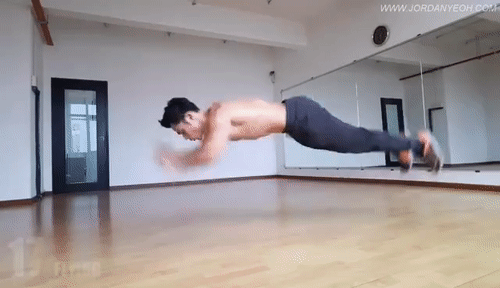

# Superman Fitness

## Superman Push-Up 

### Steps 
---
1. Starting postion: Lay down on your stomach with your arms shoulder width apart and legs straight.
1. Next, push your hands and feet off the ground symontaniously, also tightening your core and straighten your arms infront of you.
1. Returning to the ground, by placing arms and feet back to its original position prior to landing. 
1. At this point only your hands and feet should be touching the floor. This completes one rep.
