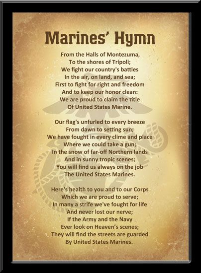

{align="center"}

Above is the emblem of the Marines. The symbol has three distinct features: an eagle, a globe and an anchor.
#### Eagle
Is the national bird of the United States. It represents Marine’s commitment to protect their country.
#### Globe 
Represents the Marine’s global presence.
#### Anchor 
Shows both their rich naval heritage and their capacity to globally reach any shore.

The Marines’ Hymn commemorates the first battles
In 1847 the Marines took part in the Mexican-American War, during which they took Chapultepec Castle in Mexico City.
The Marines’ Hymn is very well known and starts with the line, “From the Halls of Montezuma,” which refers directly to this battle.  The next words are, “To the shores of Tripoli,” which refers directly to the First Barbary War and the defeat of the City of Derna.

[Homepage](index.md) 
